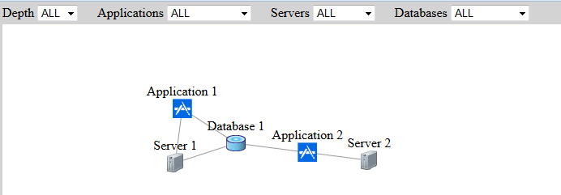
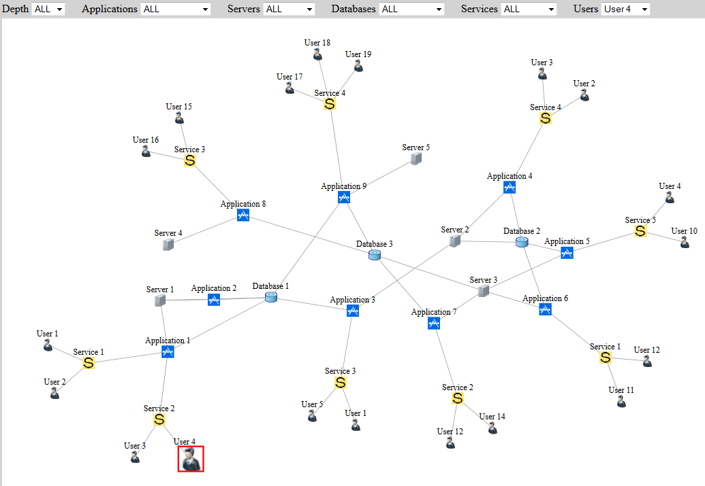

json2graph
==========

Javascript library to show json data on graph

**json2graph** is a free [graph drawing](http://en.wikipedia.org/wiki/Graph_drawing) library for JavaScript.

It relies on [Viva Graph](https://github.com/anvaka/VivaGraphJS) library to draw graph. 

How to use
----------------------------------------------------
To draw a network graph, you need to create data on json format only!
Json format sample is like following;
```
{
	"types":
	[
		{
			"name":"Applications",
			"icon": "images/application-icon.png",
			"nodes": [ {"id":11, "name":"Application 1" }, {"id":12, "name":"Application 2" } ]
		},
		{
			"name":"Servers",
			"icon": "images/server-icon.png",
			"nodes": [ {"id":21, "name":"Server 1"}, {"id":22, "name":"Server 2" } ]
		},
		{
			"name":"Databases",
			"icon": "images/database-icon.png",
			"nodes": [ {"id":31, "name":"Database 1" } ]
		}
	],
	"relations": [
	 	{"src":11, "dst":21}, {"src":12, "dst":22},	{"src":11, "dst":31}, {"src":12, "dst":31}, {"src":31, "dst":21}					
	]
}

```

Output graph for this data is like following;



Filtering options created automatically from types in data.

Here is more complex example;



I need your feedback
----------------------------------------------------
I would love to hear your feedback and suggestions. 
